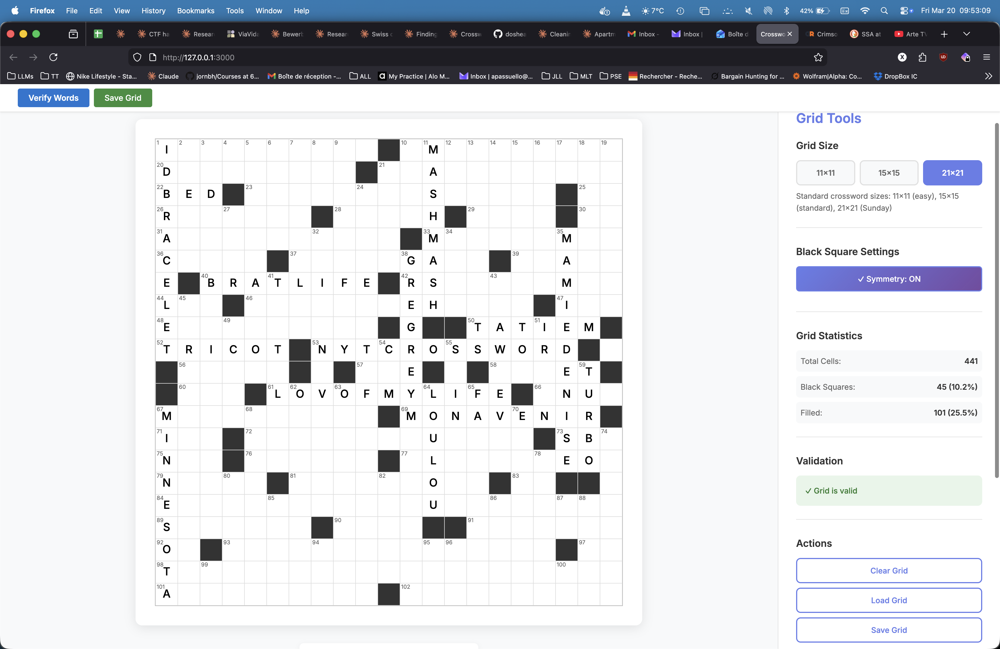
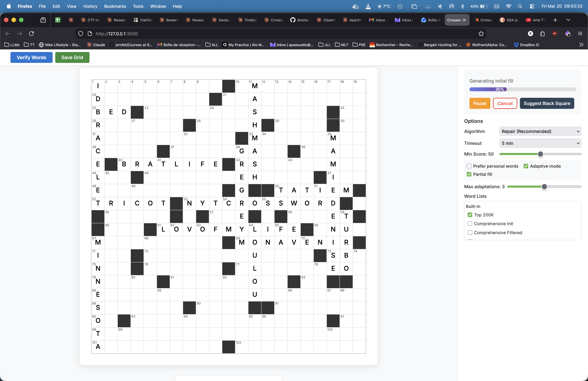
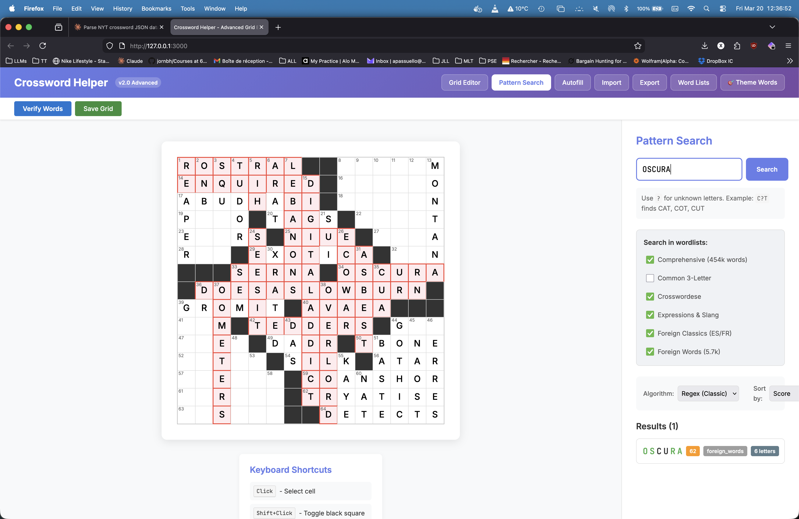

# Crossword Construction Helper

A toolkit for building crossword puzzles. It has a web UI for interactive grid
editing and autofill, plus a CLI for scripting and batch operations. All puzzle
logic lives in the CLI; the web app is a thin wrapper around it.







## Quick Start

```bash
# One-time setup (creates venv, installs deps, builds frontend)
chmod +x setup.sh
./setup.sh

# Run the app
source venv/bin/activate
python3 run.py
# Open http://localhost:5000
```

## Features

- **Grid editor** -- interactive editing with keyboard shortcuts, symmetry
  enforcement, and auto-numbering
- **Pattern matching** -- find words matching a pattern like `C?T` (gives CAT,
  COT, CUT, etc.) using regex or trie-based search
- **Autofill** -- fill grids using CSP with backtracking, beam search, or
  iterative repair; supports theme word locking
- **Wordlists** -- ships with 454k+ words; upload your own or combine multiple
  lists
- **Import/Export** -- JSON grid format, PDF export, .puz export

## Development Mode

For hot-reloading during frontend development, run two terminals:

```bash
# Terminal 1: Flask backend on :5000
source venv/bin/activate
python3 run.py

# Terminal 2: Vite dev server on :3000 (proxies API to Flask)
npm run dev
```

Open http://localhost:3000 -- frontend changes reload automatically.

## CLI Usage

The CLI is the source of truth for all puzzle logic. Activate the venv first.

```bash
# Pattern search
python -m cli.src.cli pattern "C?T" -w data/wordlists/comprehensive.txt --json-output

# Fill an example grid (11x11, 15x15, and 21x21 templates included)
python -m cli.src.cli fill data/grids/example_15x15.json \
  -w data/wordlists/comprehensive.txt \
  -t 180 --min-score 30 -o filled.json

# Validate a grid
python -m cli.src.cli validate puzzle.json

# Create a new empty grid
python -m cli.src.cli new --size 15 -o puzzle.json

# Export to PDF
python -m cli.src.cli export filled.json --format pdf -o puzzle.pdf
```

## Running Tests

```bash
# Backend + CLI tests
source venv/bin/activate
pytest

# Frontend tests
npm test

# With coverage
pytest --cov=backend --cov=cli
npm run test:coverage
```

## Project Layout

```
backend/           Flask API (routes, CLIAdapter, wordlist management)
cli/src/           CLI tool and all core algorithms (fill, pattern, grid)
src/               React frontend (components, styles)
data/wordlists/    Word lists (comprehensive.txt + specialty lists)
```

## Known Limitations

- The CLI `--theme-entries` flag does not reliably lock theme words during
  autofill. Use the web interface for themed puzzles instead.
- No multi-user or authentication support. Runs locally only.

## Tech Stack

- **Backend:** Python 3.9+, Flask, Click, NumPy, pytest
- **Frontend:** React 18, Vite 5, SCSS, Axios, vitest

## License

MIT
