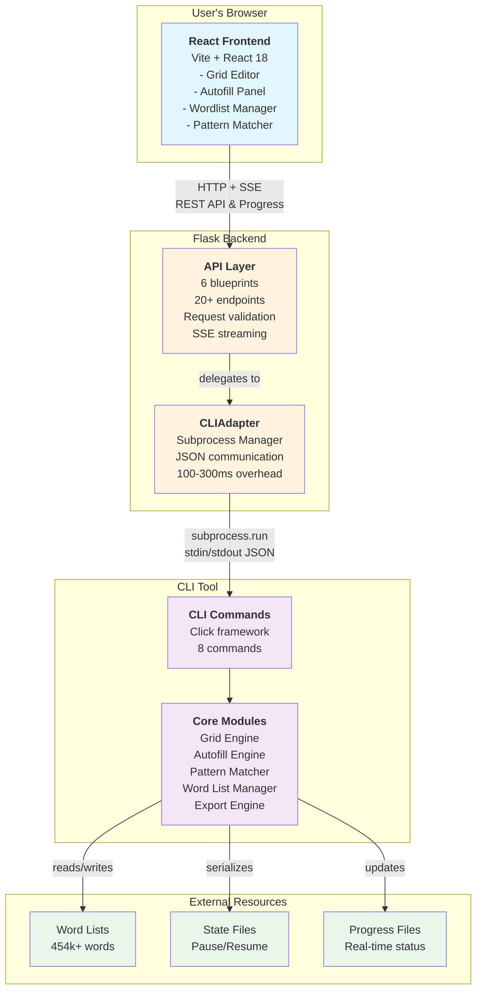
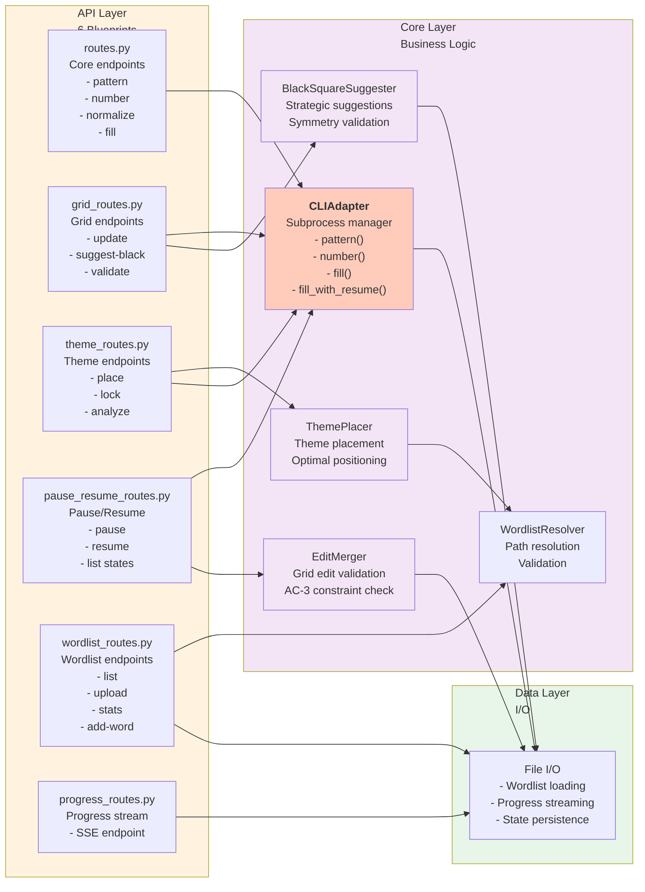

# Integration Guide: Mermaid Diagrams into ARCHITECTURE.md

Step-by-step instructions for integrating the three Mermaid diagrams into ARCHITECTURE.md.

---

## Quick Reference

| Diagram | Replaces Section | Location | Lines |
|---------|------------------|----------|-------|
| System Components | 2: System Overview | "Three-Component Architecture" | 66-122 |
| Autofill Data Flow | 5.2: Data Flow | "Autofill Process (Detailed)" | 586-643 |
| Backend Architecture | 4.2: Backend API | After "API Endpoints" list | After 357 |

---

## Detailed Integration Steps

### Step 1: System Component Diagram

**File:** `/docs/ARCHITECTURE.md`
**Section:** Section 2 - System Overview
**Subsection:** "Three-Component Architecture"
**Lines to Replace:** 66-122

**Current Content (to remove):**
```
### Three-Component Architecture

```
┌─────────────────────────────────────────────────────────┐
│                    User's Browser                        │
│  ┌───────────────────────────────────────────────────┐  │
...
└───────────────────────────────────────────────────────┘
```
```

**Replacement Text:**

```markdown
### Three-Component Architecture


```

**Keep Following Content (unchanged):**
- "Integration Pattern: CLI as Backend" section remains unchanged

---

### Step 2: Autofill Data Flow Diagram

**File:** `/docs/ARCHITECTURE.md`
**Section:** Section 5 - Data Flow
**Subsection:** "5.2 Autofill Process (Detailed)"
**Lines to Replace:** 586-643

**Current Content (to remove):**
```
### 5.2 Autofill Process (Detailed)

```
1. User clicks "Start Autofill" button
   └─► AutofillPanel.jsx gathers parameters
...
└─► Frontend: Highlight unfillable regions, suggest fixes
```
```

**Replacement Text:**

```markdown
### 5.2 Autofill Process (Detailed)

The autofill operation involves coordinated action between frontend, backend, and CLI process with real-time progress monitoring via Server-Sent Events.

```mermaid
sequenceDiagram
    actor User
    participant Frontend as React Frontend
    participant Backend as Flask Backend
    participant CLI as CLI Process
    participant Files as Filesystem

    User->>Frontend: Click "Start Autofill"<br/>Select algorithm, wordlists
    Frontend->>Backend: POST /api/fill<br/>(grid, params, theme entries)
    Backend->>Backend: Validate request<br/>Resolve wordlist paths

    Backend->>CLI: subprocess.run()<br/>crossword fill --algorithm hybrid
    CLI->>Files: Load grid from JSON
    CLI->>Files: Load wordlists (454k words)
    CLI->>CLI: Initialize Beam Search

    par Autofill Loop
        CLI->>CLI: Select empty slot (MCV)
        CLI->>CLI: Pattern match → candidates
        CLI->>CLI: Score candidates (LCV)
        CLI->>CLI: Try top candidate
        CLI->>CLI: Check constraints (AC-3)
        CLI->>Files: Write progress (every 100 iter)
        CLI->>Files: Check pause signal
    end

    Backend->>Files: Monitor progress file<br/>(every 500ms)
    Backend->>Frontend: SSE: {"status":"running",<br/>"iteration":5432}
    Frontend->>Frontend: Update progress bar<br/>Show stats

    alt Success
        CLI->>Files: Write filled grid
        Backend->>Frontend: SSE: {"status":"complete"}
        Frontend->>User: Display filled grid
    else Timeout/Failure
        CLI->>Files: Write problematic slots
        Backend->>Frontend: SSE: {"status":"error"}
        Frontend->>User: Highlight unfillable regions
    end

    style User fill:#e1f5ff
    style Frontend fill:#e1f5ff
    style Backend fill:#fff3e0
    style CLI fill:#f3e5f5
    style Files fill:#e8f5e9
```

**Detailed Process Breakdown:**

The diagram above shows the complete autofill sequence. Here's what happens at each stage:

1. **User Initiation** - User selects algorithm, wordlists, and timeout parameters
2. **Request Submission** - Frontend sends POST /api/fill with grid and parameters
3. **Backend Validation** - Request validated, wordlist paths resolved
4. **CLI Execution** - CLI subprocess spawned with crossword fill command
5. **Data Loading** - CLI loads grid JSON and wordlists into memory
6. **Autofill Loop** - Main loop runs with progress updates every 100 iterations
7. **Progress Monitoring** - Backend monitors progress file, streams updates via SSE
8. **UI Updates** - Frontend receives SSE events, updates progress bar in real-time
9. **Completion** - Success path returns filled grid; failure path returns problematic slots

See [PAUSE_RESUME_ARCHITECTURE.md](PAUSE_RESUME_ARCHITECTURE.md) for details on pausing and resuming operations.
```

---

### Step 3: Backend Architecture Diagram

**File:** `/docs/ARCHITECTURE.md`
**Section:** Section 4.2 - Backend API
**Location:** Immediately after the "API Endpoints" section
**Insertion Point:** After line 357 (after Progress Endpoints list)

**New Subsection to Add:**

```markdown
#### Backend Architecture Diagram

The following diagram shows how the six API blueprints integrate with the core layer modules and data layer:



**Key Observations:**

- **CLIAdapter** is the central integration point, used by most API routes
- **EditMerger** handles pause/resume validation with constraint checking
- **ThemePlacer** works with **WordlistResolver** for optimal word placement
- All core modules ultimately interact with the **Data Layer** for file I/O
- Color coding shows layer hierarchy: API (orange) → Core (purple) → Data (green)

```

---

## Verification Checklist

After making the changes, verify:

- [ ] **Diagram 1** renders correctly under "Three-Component Architecture"
  - [ ] All 4 subgraphs visible: Browser, Backend, CLI, Data
  - [ ] All arrows labeled with communication protocols
  - [ ] Colors consistent (Blue, Orange, Purple, Green)
  - [ ] No syntax errors in markdown

- [ ] **Diagram 2** renders correctly under "Autofill Process (Detailed)"
  - [ ] All 4 actors shown: User, Frontend, Backend, CLI, Files
  - [ ] Sequential steps clear
  - [ ] Both success and failure paths visible
  - [ ] SSE streaming shown in parallel

- [ ] **Diagram 3** renders correctly in new subsection
  - [ ] 6 blueprints shown in top subgraph
  - [ ] 5 core modules in middle subgraph
  - [ ] Data layer at bottom
  - [ ] All arrows show correct dependencies

- [ ] **No content removed unintentionally**
  - [ ] "Integration Pattern: CLI as Backend" still present
  - [ ] "5.3 Pause/Resume Flow" still present
  - [ ] "5.4 Pattern Search Flow" still present
  - [ ] All numbered sections still match ToC

- [ ] **Markdown syntax correct**
  - [ ] Code blocks properly escaped with triple backticks
  - [ ] No broken links
  - [ ] Section headers intact

---

## Testing the Diagrams

### Local Testing (if using VS Code or similar):

1. **Install Mermaid extension** (if desired for live preview)
2. **Open ARCHITECTURE.md**
3. **Navigate to each diagram section**
4. **Verify rendering** (should show visual diagram, not code)

### GitHub Testing:

1. **Push changes to repository**
2. **View ARCHITECTURE.md on GitHub**
3. **Scroll to each diagram section**
4. **Verify GitHub renders Mermaid correctly**

### Web Testing:

1. **Visit [Mermaid Live Editor](https://mermaid.live/)**
2. **Copy each diagram code**
3. **Paste into editor**
4. **Verify rendering and layout**

---

## Rollback Instructions

If you need to revert to ASCII diagrams:

1. **Restore from git:**
   ```bash
   git checkout HEAD -- docs/ARCHITECTURE.md
   ```

2. **Manual restoration:**
   - Copy ASCII diagrams from `/docs/MERMAID_DIAGRAMS.md` (they're documented there)
   - Paste back into ARCHITECTURE.md at original locations

---

## Post-Integration Tasks

After successfully integrating diagrams:

1. **Update Table of Contents** (if sections moved)
2. **Create cross-references** from diagrams to detailed sections
3. **Add notes** about diagram customization (see DIAGRAM_REFERENCE.md)
4. **Consider removing** redundant ASCII diagrams elsewhere in documentation
5. **Version control** - Commit with message: "refactor: Replace ASCII diagrams with Mermaid"

---

## Common Issues and Solutions

### Issue: Diagram not rendering in GitHub

**Cause:** GitHub may cache old version

**Solution:**
```bash
# Clear browser cache or use incognito mode
# If needed, reload page: Ctrl+Shift+R (Windows/Linux) or Cmd+Shift+R (Mac)
```

### Issue: Colors not displaying correctly

**Cause:** Different markdown renderer

**Solution:**
- Add color definitions explicitly: `style NodeName fill:#e1f5ff`
- Already included in provided diagrams

### Issue: Text too small or overlapping

**Cause:** Container width constraints

**Solution:**
- Shorten labels in diagram
- Use `<br/>` for line breaks within nodes
- Already optimized in provided diagrams

### Issue: Diagram rendering takes too long

**Cause:** Complex diagram or slow connection

**Solution:**
- All three diagrams are optimized for fast rendering
- Usually <1s load time
- Check network speed if slower

---

## File References

**Related Files to Review:**

- `/docs/ARCHITECTURE.md` - Main document being updated
- `/docs/MERMAID_DIAGRAMS.md` - Complete diagram code reference
- `/docs/DIAGRAM_REFERENCE.md` - Detailed explanation of each diagram
- `/docs/PAUSE_RESUME_ARCHITECTURE.md` - Referenced by Diagram 2
- `/docs/API_SPECIFICATION.md` - Referenced by Diagram 3

---

## Questions?

Refer to:
- **MERMAID_DIAGRAMS.md** for raw diagram code
- **DIAGRAM_REFERENCE.md** for detailed explanations
- **ARCHITECTURE.md** for complete system documentation

---

**Last Updated:** 2025-12-27
**Version:** 1.0
**Status:** Ready for Integration
