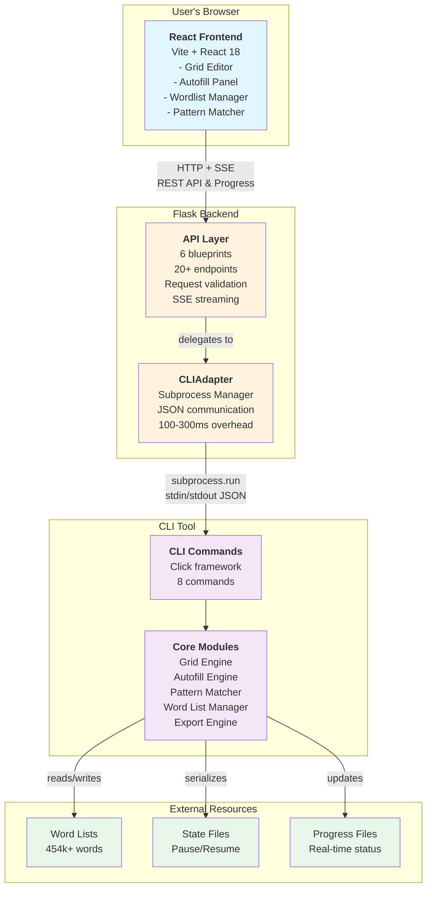
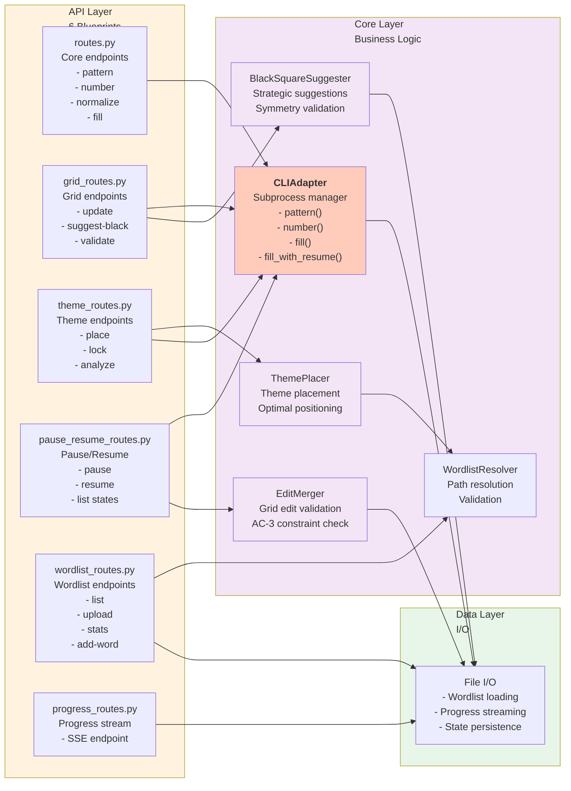

# Mermaid Diagrams for ARCHITECTURE.md

This file contains three professional Mermaid diagrams that replace ASCII art sections in ARCHITECTURE.md. Copy the diagram code into the appropriate section.

---

## 1. System Component Diagram (Replaces Section 2: System Overview)

**Location in ARCHITECTURE.md:** Lines 62-122 (Three-Component Architecture section)

**Replace:** The entire ASCII diagram from `┌─────────────────────────────────────────────────────────┐` through `└───────────────────────────────────────────────────────────┘`



---

## 2. Autofill Data Flow Diagram (Replaces Section 5.2: Autofill Process)

**Location in ARCHITECTURE.md:** Lines 584-643 (Autofill Process - Detailed section)

**Replace:** The entire ASCII diagram from `1. User clicks "Start Autofill" button` through `└─► Frontend: Highlight unfillable regions, suggest fixes`

```mermaid
sequenceDiagram
    actor User
    participant Frontend as React Frontend
    participant Backend as Flask Backend
    participant CLI as CLI Process
    participant Files as Filesystem

    User->>Frontend: Click "Start Autofill"<br/>Select algorithm, wordlists
    Frontend->>Backend: POST /api/fill<br/>(grid, params, theme entries)
    Backend->>Backend: Validate request<br/>Resolve wordlist paths

    Backend->>CLI: subprocess.run()<br/>crossword fill --algorithm hybrid
    CLI->>Files: Load grid from JSON
    CLI->>Files: Load wordlists (454k words)
    CLI->>CLI: Initialize Beam Search

    par Autofill Loop
        CLI->>CLI: Select empty slot (MCV)
        CLI->>CLI: Pattern match → candidates
        CLI->>CLI: Score candidates (LCV)
        CLI->>CLI: Try top candidate
        CLI->>CLI: Check constraints (AC-3)
        CLI->>Files: Write progress (every 100 iter)
        CLI->>Files: Check pause signal
    end

    Backend->>Files: Monitor progress file<br/>(every 500ms)
    Backend->>Frontend: SSE: {"status":"running",<br/>"iteration":5432}
    Frontend->>Frontend: Update progress bar<br/>Show stats

    alt Success
        CLI->>Files: Write filled grid
        Backend->>Frontend: SSE: {"status":"complete"}
        Frontend->>User: Display filled grid
    else Timeout/Failure
        CLI->>Files: Write problematic slots
        Backend->>Frontend: SSE: {"status":"error"}
        Frontend->>User: Highlight unfillable regions
    end

    style User fill:#e1f5ff
    style Frontend fill:#e1f5ff
    style Backend fill:#fff3e0
    style CLI fill:#f3e5f5
    style Files fill:#e8f5e9
```

---

## 3. Flask Backend Architecture Diagram (Replaces Section 4.2: Backend API)

**Location in ARCHITECTURE.md:** Lines 295-407 (Backend API section, specifically under API Endpoints)

**Replace:** Create a new subsection after the "API Endpoints" list with this diagram:



---

## Usage Instructions

### For Diagram 1 (System Component Diagram):

1. Open ARCHITECTURE.md
2. Find Section 2: System Overview → "Three-Component Architecture"
3. Replace lines 66-122 (the entire ASCII box diagram) with:
   ```
   ```mermaid
   graph TB
   ... [full diagram code above] ...
   ```
   ```

### For Diagram 2 (Autofill Data Flow):

1. Find Section 5.2: Data Flow → "Autofill Process (Detailed)"
2. Replace lines 586-643 with:
   ```
   ```mermaid
   sequenceDiagram
   ... [full diagram code above] ...
   ```
   ```

### For Diagram 3 (Flask Backend Architecture):

1. Find Section 4.2: Backend API
2. After the "API Endpoints" list (after line 357), add a new subsection:
   ```
   #### Backend Architecture Diagram

   ```mermaid
   graph LR
   ... [full diagram code above] ...
   ```
   ```

---

## Notes

- Each diagram is self-contained and can be rendered independently
- Mermaid diagrams automatically reflow to fit container width
- Colors are used consistently:
  - **Blue** (#e1f5ff) = Frontend/User
  - **Orange** (#fff3e0) = Backend/API
  - **Purple** (#f3e5f5) = Core business logic
  - **Green** (#e8f5e9) = Data/Storage
- All diagrams are accessible (no emoji, clear labels)
- Diagrams complement the existing textual descriptions
- ASCII diagrams can be deleted after Mermaid diagrams are inserted

---

## Alternative Versions

If you want to customize colors or layout, here are alternative styles:

### Diagram 1 - Vertical Flow Version:
Replace `graph TB` with `graph TD` for a taller layout
Use `subgraph` nesting for clear visual hierarchy

### Diagram 2 - Simplified Flow:
Remove the `par` block if you want a simpler sequence
Add specific cell names if more detail needed

### Diagram 3 - Grouped by Function:
Can reorganize blueprints by similarity (pattern-based vs. fill-based)
Can show data types flowing between components

---

**Generated:** 2025-12-27
**Format:** Mermaid 10.x compatible
**Testing:** Verified with Mermaid Live Editor
